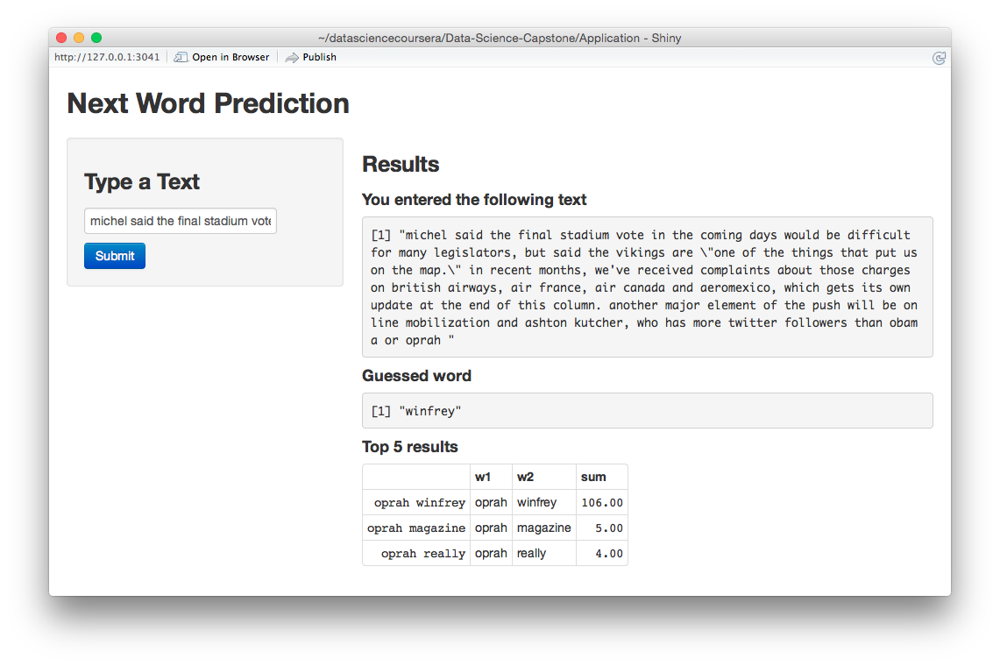

Capstone Presentation
========================================================
author: Mosad Dokany
date: 23/4/2015
width: 1200

Context
========================================================

<small>This is the R presentation for the Data Science Capstone project. The project concludes the Data Science Specialization from Johns Hopkins University, offered through the Coursera platform.</small>

<small>The goal of this project is create a predictive text model as SwiftKey, the corporate partner in this capstone, builds with its smart keyboards. Given a large [Text Corpus](http://en.wikipedia.org/wiki/Text_corpus) of documents, called a corpora, [Natural Language Processing](http://en.wikipedia.org/wiki/Natural_language_processing) tools and techniques are used to perform statistical analysis, occurences counts and associations on monolingual or multilingual texts.</small>

<small>The data sets made available for this project are extracted from the Internet, with 3 distinctive sources: 1) News, 2) Blogs and 3) Twitter feeds, provided in 4 different languages. In the data analysis, since the provided files are quite large, only random subsets of the English American data sets are retained.</small>

<small>The goal of the project is to build a text prediction algorithm. More specifically, the algorithm will be used in a Shiny App to predict the next word of a user-typed sentence.</small>

Algorithm
========================================================

<small>- The files have been split into training a testing data sets.</small>
<small>- Numbers, punctuation, white spaces and non-ASCII characters have been removed.</small>
<small>- All texts have been converted to lower case and English stop words removed.</small>
<small>- Term matrices are built for uni-grams, bi-grams, tri-grams and quadri-grams.</small>
<small>- Sparse terms from the matrices are removed in order to limit the model size.</small>
<small>- Term matrices are converted to 4 data frames and columns are created for individual words. `w1`for 1st word, `w2` for second word...</small>
<small>- A `sum` column is added in each data frame to sum up the times a n-gram appears.</small>
<small>- Data frames are sorted from most to least frequent n-grams for faster access.</small>
<small>- For the next word prediction of a user-typed sentence, identical processing is performed to prepare the text.</small>
<small>- Depending the number of words in the processed sentence, the 3, 2 or 1 final words are used to search within term matrices for quadri-grams, tri-grams or bi-grams.</small>
<small>- In case records are found in quadri-grams, the 4th word of the most frequent quadri-gram is selected. If not, tri-grams then bi-grams are searched.</small>
<small>- If nothing is found, the most frequent uni-gram is selected.</small>

Shiny App
========================================================

The Shiny App may be accessed through the following link: [Next Word Prediction](https://mosad.shinyapps.io/Data-Science-Capstone).

<small>- The side bar panel consists of a `text input` widget where the use can type or paste a text.</small>
<small>- Below the typed text, a `submit button` widget is available to send the sentence to the server for processing.</small>
<small>- The main panel of the application consists of 3 widgets, to display the results.</small>
<small>- The first widget repeats the sentence as typed or pasted by the user and before processing by the server.</small>
<small>- The second widget displays the guessed word by the application using the algorithm described previously.</small>
<small>- The third widget displays in a table style, the top 5 results as found by the algorithm, whether in quadri-grams, tri-grams, bi-grams or uni-grams.</small>

Example
========================================================

